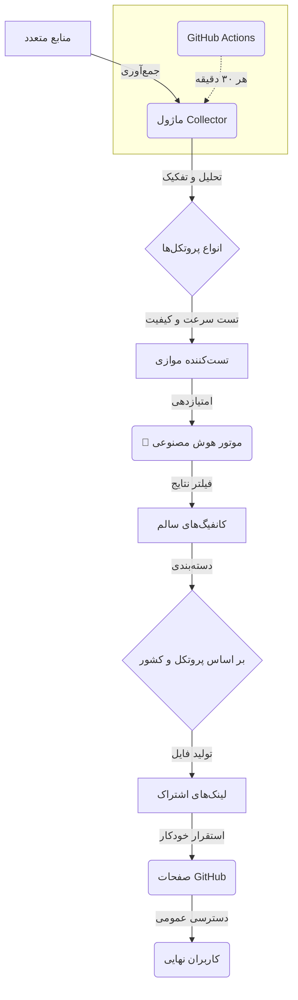

<div align="center">

#  Onix V2Ray Collector 

**جمع‌آوری و تست هوشمند کانفیگ‌های V2Ray با قدرت هوش مصنوعی**

<p>
<a href="https://github.com/rpg-dev420/Onix-V2Ray-Collector/blob/main/README_EN.md">English</a> •
<a href="https://github.com/rpg-dev420/Onix-V2Ray-Collector/blob/main/README.md">فارسی</a>
</p>


</div>

<div align="center">
  
</div>

---

## 🎯 **پروژه Onix Collector چیست؟**

**Onix V2Ray Collector** یک سیستم هوشمند، خودکار و قدرتمند برای جمع‌آوری، تست و امتیازدهی به کانفیگ‌های V2Ray از سراسر وب است. این پروژه با استفاده از **هوش مصنوعی**، بهترین و سریع‌ترین کانفیگ‌ها را برای شما پیدا کرده و آن‌ها را در دسته‌بندی‌های مختلف (بر اساس پروتکل و کشور) از طریق لینک‌های اشتراک (Subscription) ارائه می‌دهد.

این سیستم به‌طور خودکار هر **۳۰ دقیقه** یک‌بار به‌روزرسانی می‌شود و بیش از **۱۰,۰۰۰ کانفیگ** از **۱۲۰+ منبع** معتبر را بررسی می‌کند.

## ✨ **ویژگی‌های کلیدی**

|                          |                                                                                                                                                                                                                                 |
| ------------------------ | ------------------------------------------------------------------------------------------------------------------------------------------------------------------------------------------------------------------------------- |
| **🤖 امتیازدهی با هوش مصنوعی**  | **مدل یادگیری ماشین (RandomForest)** برای پیش‌بینی کیفیت کانفیگ‌ها بر اساس **۱۵+ ویژگی** مختلف (سرعت، پایداری، امنیت).                                                                                                         |
| **⚡️ تست فوق سریع**        | استفاده از **Connection Pool** برای تست همزمان **۵۰+ کانفیگ** با منطق **Retry** هوشمند و مدیریت **Timeout** برای حداکثر کارایی.                                                                                                |
| **🔄 اتوماسیون کامل**        | **GitHub Actions** برای جمع‌آوری، تست و استقرار خودکار هر **۳۰ دقیقه**. بدون نیاز به سرور یا اجرای دستی!                                                                                                                            |
| **📊 داشبورد تحلیلی**      | رابط کاربری مدرن با **نمودارهای زنده (Chart.js)**، آمار دقیق، تم تاریک/روشن و طراحی **Responsive** برای موبایل.                                                                                                                   |
| **🗂 دسته‌بندی هوشمند**      | تفکیک خودکار کانفیگ‌ها بر اساس **پروتکل** (VLESS, VMess, Trojan, ...) و **کشور** (با GeoIP) و ارائه لینک‌های اشتراک مجزا.                                                                                                         |
| **🔌 پشتیبانی از API**        | **REST API** قدرتمند (ساخته شده با FastAPI) با مستندات **Swagger UI** برای دسترسی برنامه‌نویسان به داده‌ها و آمار.                                                                                                                 |
| **🛡 امنیت و پایداری**    | مجهز به سیستم‌های **Cache Manager** برای کاهش بار شبکه، **Error Recovery** برای مقابله با خطاها و **Health Monitoring** برای نظارت بر سلامت سیستم.                                                                                   |
| **🤖 ربات تلگرام**        | یک ربات تلگرام پیشرفته برای دریافت آمار، کانفیگ‌ها و مدیریت سیستم با دستورات ادمین. ([راهنمای کامل ربات](https://github.com/rpg-dev420/Onix-V2Ray-Collector/blob/main/TELEGRAM_BOT_GUIDE.md)) |

---

## 🚀 **شروع سریع**

می‌توانید این پروژه را به سادگی روی سیستم خود اجرا کنید. **روش پیشنهادی استفاده از Docker است.**

<details>
<summary>🐳 **اجرا با Docker (پیشنهادی)**</summary>

```bash
# 1. پروژه را کلون کنید
git clone https://github.com/rpg-dev420/Onix-V2Ray-Collector.git
cd Onix-V2Ray-Collector

# 2. کانتینرها را بسازید و اجرا کنید
docker-compose up -d

# 3. برای مشاهده لاگ‌ها
docker-compose logs -f
```

</details>

<details>
<summary>🐍 **اجرا با پایتون (دستی)**</summary>

```bash
# 1. پروژه را کلون کنید
git clone https://github.com/rpg-dev420/Onix-V2Ray-Collector.git
cd Onix-V2Ray-Collector

# 2. وابستگی‌ها را نصب کنید
pip install -r requirements.txt

# 3. (اختیاری) تست‌ها را اجرا کنید
python run_tests.py

# 4. اسکریپت جمع‌آوری را اجرا کنید
python run_collection.py
```
</details>

---

## 🌐 **لینک‌های اشتراک و داشبورد**

- **صفحه اصلی (شامل تمام لینک‌ها):**
  - [https://rpg-dev420.github.io/Onix-V2Ray-Collector/](https://rpg-dev420.github.io/Onix-V2Ray-Collector/)

- **داشبورد تحلیلی:**
  - [https://rpg-dev420.github.io/Onix-V2Ray-Collector/subscriptions/dashboard.html](https://rpg-dev420.github.io/Onix-V2Ray-Collector/subscriptions/dashboard.html)

- **مهم‌ترین لینک‌های اشتراک:**
  - **همه کانفیگ‌ها (یکی شده):**
    - `https://raw.githubusercontent.com/rpg-dev420/Onix-V2Ray-Collector/main/subscriptions/all_subscription.txt`
  - **همه کانفیگ‌ها (Base64):**
    - `https://raw.githubusercontent.com/rpg-dev420/Onix-V2Ray-Collector/main/subscriptions/all_subscription_base64.txt`
  - **کانفیگ‌های VLESS:**
    - `https://raw.githubusercontent.com/rpg-dev420/Onix-V2Ray-Collector/main/subscriptions/vless_subscription.txt`
  - **کانفیگ‌های VMess:**
    - `https://raw.githubusercontent.com/rpg-dev420/Onix-V2Ray-Collector/main/subscriptions/vmess_subscription.txt`

---

## 🏗️ **معماری سیستم**

این دیاگرام، جریان کاری پروژه از جمع‌آوری تا ارائه کانفیگ به کاربر نهایی را نمایش می‌دهد.



---

## 🛠 **تکنولوژی‌های استفاده شده**


---

## 🤝 **مشارکت در پروژه**

از هرگونه مشارکت در این پروژه استقبال می‌کنیم! شما می‌توانید از طریق موارد زیر به ما کمک کنید:

- **ثبت Issue:** اگر با باگ یا مشکلی مواجه شدید، یک [Issue جدید](https://github.com/rpg-dev420/Onix-V2Ray-Collector/issues) ثبت کنید.
- **ارسال Pull Request:** اگر کد جدیدی نوشته‌اید یا بهبودهایی اعمال کرده‌اید، برای ما [Pull Request](https://github.com/rpg-dev420/Onix-V2Ray-Collector/pulls) ارسال کنید.
- **دادن ستاره:** اگر این پروژه برای شما مفید بوده، با ⭐ دادن به آن از ما حمایت کنید.

لطفاً قبل از مشارکت، راهنمای [CONTRIBUTING.md](https://github.com/rpg-dev420/Onix-V2Ray-Collector/blob/main/CONTRIBUTING.md) را مطالعه کنید.

## 📄 **مجوز (License)**

این پروژه تحت مجوز **MIT** منتشر شده است. برای اطلاعات بیشتر فایل [LICENSE](https://github.com/rpg-dev420/Onix-V2Ray-Collector/blob/main/LICENSE) را مشاهده کنید.

---

<div align="center">
  با ❤️ ساخته شده توسط <a href="https://github.com/rpg-dev420">rpg-dev420</a>
</div>


