<div align="center">

#  Onix V2Ray Collector 

**An intelligent, AI-powered V2Ray config collector and tester.**

<p>
<a href="https://github.com/AhmadAkd/Onix-V2Ray-Collector/blob/main/README_EN.md">English</a> •
<a href="https://github.com/AhmadAkd/Onix-V2Ray-Collector/blob/main/README.md">فارسی</a>
</p>


</div>

<div align="center">
  
</div>

---

## 🎯 **What is Onix Collector?**

**Onix V2Ray Collector** is an intelligent, automated, and powerful system designed to collect, test, and score V2Ray configurations from across the web. Powered by **Artificial Intelligence**, this project finds the best and fastest configs for you, categorizes them (by protocol and country), and provides them through subscription links.

The system automatically updates every **30 minutes**, scanning over **10,000 configs** from **120+ trusted sources**.

## ✨ **Key Features**

|                          |                                                                                                                                                                                                                                     |
| ------------------------ | ----------------------------------------------------------------------------------------------------------------------------------------------------------------------------------------------------------------------------------- |
| **🤖 AI-Powered Scoring**    | A **Machine Learning model (RandomForest)** predicts config quality based on **15+ features** like speed, stability, and security.                                                                                                |
| **⚡️ Ultra-Fast Testing**    | Utilizes a **Connection Pool** to test **50+ configs concurrently**, with smart **Retry Logic** and **Timeout Management** for maximum efficiency.                                                                                |
| **🔄 Fully Automated**       | **GitHub Actions** handle automatic collection, testing, and deployment every **30 minutes**. No server or manual execution required!                                                                                            |
| **📊 Analytical Dashboard** | A modern UI with **live charts (Chart.js)**, detailed statistics, dark/light themes, and a **Responsive Design** for mobile devices.                                                                                              |
| **🗂 Smart Categorization** | Automatically sorts configs by **protocol** (VLESS, VMess, Trojan, etc.) and **country** (via GeoIP), providing separate subscription links for each.                                                                              |
| **🔌 Full API Support**      | A powerful **REST API** (built with FastAPI) with **Swagger UI** documentation, giving developers access to data and statistics.                                                                                                      |
| **🛡 Secure & Stable**       | Equipped with a **Cache Manager** to reduce network load, **Error Recovery** to handle failures gracefully, and **Health Monitoring** to oversee system stability.                                                                 |
| **🤖 Telegram Bot**         | An advanced Telegram bot for real-time stats, config retrieval, and system management with admin commands. ([Full Bot Guide](https://github.com/AhmadAkd/Onix-V2Ray-Collector/blob/main/TELEGRAM_BOT_GUIDE.md)) |

---

## 🚀 **Quick Start**

You can easily run this project on your own system. **The recommended method is using Docker.**

<details>
<summary>🐳 **Run with Docker (Recommended)**</summary>

```bash
# 1. Clone the repository
git clone https://github.com/AhmadAkd/Onix-V2Ray-Collector.git
cd Onix-V2Ray-Collector

# 2. Build and run the containers
docker-compose up -d

# 3. To view logs
docker-compose logs -f
```

</details>

<details>
<summary>🐍 **Run with Python (Manual)**</summary>

```bash
# 1. Clone the repository
git clone https://github.com/AhmadAkd/Onix-V2Ray-Collector.git
cd Onix-V2Ray-Collector

# 2. Install dependencies
pip install -r requirements.txt

# 3. (Optional) Run tests
python run_tests.py

# 4. Run the collection script
python run_collection.py
```
</details>

---

## 🌐 **Subscription Links & Dashboard**

- **Main Page (All Subscription Links):**
  - [https://ahmadakd.github.io/Onix-V2Ray-Collector/](https://ahmadakd.github.io/Onix-V2Ray-Collector/)

- **Analytical Dashboard:**
  - [https://ahmadakd.github.io/Onix-V2Ray-Collector/subscriptions/dashboard.html](https://ahmadakd.github.io/Onix-V2Ray-Collector/subscriptions/dashboard.html)

- **Main Subscription Links:**
  - **All Configs (Merged):**
    - `https://raw.githubusercontent.com/AhmadAkd/Onix-V2Ray-Collector/main/subscriptions/all_subscription.txt`
  - **All Configs (Base64):**
    - `https://raw.githubusercontent.com/AhmadAkd/Onix-V2Ray-Collector/main/subscriptions/all_subscription_base64.txt`
  - **VLESS Configs:**
    - `https://raw.githubusercontent.com/AhmadAkd/Onix-V2Ray-Collector/main/subscriptions/vless_subscription.txt`
  - **VMess Configs:**
    - `https://raw.githubusercontent.com/AhmadAkd/Onix-V2Ray-Collector/main/subscriptions/vmess_subscription.txt`

---

## 🏗️ **System Architecture**

This diagram illustrates the project's workflow, from data collection to delivering the final configs to the end-user.

```mermaid
graph TD
    A[Multiple Sources] -->|Collect| B(Collector Module)
    B -->|Parse & Decode| C{Protocol Types}
    C -->|Test Speed & Quality| D[Parallel Tester]
    D -->|Score| E(🧠 AI Engine)
    E -->|Filter Results| F[Healthy Configs]
    F -->|Categorize| G{By Protocol & Country}
    G -->|Generate Files| H[Subscription Links]
    H -->|Auto-Deploy| I(GitHub Pages)
    I -->|Public Access| J(End Users)

    subgraph " "
        direction LR
        K(GitHub Actions) -.->|Every 30 Mins| B
    end
```



---

## 🛠 **Tech Stack**


---

## 🤝 **Contributing**

We welcome all contributions! You can help us in the following ways:

- **Reporting Bugs:** If you find a bug, please open a [new issue](https://github.com/AhmadAkd/Onix-V2Ray-Collector/issues).
- **Submitting Pull Requests:** If you have new code or improvements, feel free to send a [pull request](https://github.com/AhmadAkd/Onix-V2Ray-Collector/pulls).
- **Giving a Star:** If you find this project useful, please support us by giving it a ⭐.

Please read our [CONTRIBUTING.md](https://github.com/AhmadAkd/Onix-V2Ray-Collector/blob/main/CONTRIBUTING.md) guide before you start.

## 📄 **License**

This project is licensed under the **MIT License**. See the [LICENSE](https://github.com/AhmadAkd/Onix-V2Ray-Collector/blob/main/LICENSE) file for more details.

---

<div align="center">
  Made with ❤️ by <a href="https://github.com/AhmadAkd">AhmadAkd</a>
</div>
